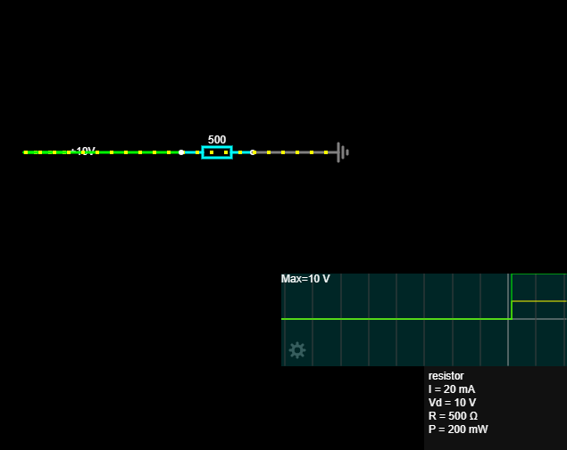

# 03 - Ohmov zakon

## Cilj vježbe

Razumjeti odnos između napona, struje i otpora u jednostavnom električnom krugu.

## Osnovne veličine

- U = napon, jedinica volt (V)
- I = struja, jedinica amper (A)
- R = otpor, jedinica om (Ω)

## Formula

U = I × R  
I = U / R  
R = U / I

## Falstad vježba

Napravio sam jednostavni krug s DC izvorom i otpornikom.

Primjer:

- U = 5 V
- R = 1000 Ω
- I = 5 / 1000 = 0,005 A = 5 mA

## Zaključak

Veći napon povećava struju.  
Veći otpor smanjuje struju.  
Ohmov zakon pokazuje osnovni odnos između napona, struje i otpora.

## Slika simulacije

