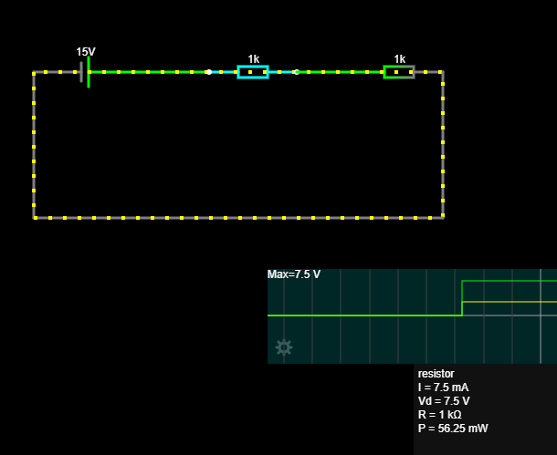

# 05 - Serijski spoj otpornika

## Cilj vježbe

Cilj ove vježbe bio je razumjeti kako radi serijski spoj otpornika i kako se računaju ukupni otpor, struja i pad napona na pojedinim otpornicima.

## Opis spoja

U serijskom spoju komponente su spojene jedna za drugom. Struja prolazi kroz prvi otpornik, zatim kroz drugi, i vraća se natrag na izvor napona.

Primjer spoja:

```text
+ izvor → R1 → R2 → - izvor
```

## Zadane vrijednosti

```text
U = 15 V
R1 = 1 kΩ
R2 = 1 kΩ
```

## Izračun ukupnog otpora

Kod serijskog spoja otpori se zbrajaju:

```text
Ruk = R1 + R2
Ruk = 1000 Ω + 1000 Ω
Ruk = 2000 Ω = 2 kΩ
```

## Izračun struje

Prema Ohmovom zakonu:

```text
I = U / Ruk
I = 15 V / 2000 Ω
I = 0,0075 A = 7,5 mA
```

## Napon na otpornicima

U serijskom spoju kroz sve otpornike teče ista struja, ali se ukupni napon dijeli na otpornike.

Budući da su otpornici jednaki, napon se dijeli jednako:

```text
UR1 ≈ 5 V
UR2 ≈ 5 V
```

## Slika simulacije




## Zaključak

U serijskom spoju ukupni otpor jednak je zbroju pojedinačnih otpora.

Kroz sve otpornike teče ista struja.

Ukupni napon izvora dijeli se na otpornike. Ako su otpornici jednaki, napon se dijeli jednako.

U ovoj vježbi izvor napona bio je 15 V, a dva otpornika imala su po 1 kΩ. Ukupni otpor bio je 2 kΩ, a struja u krugu približno 7,5 mA.

