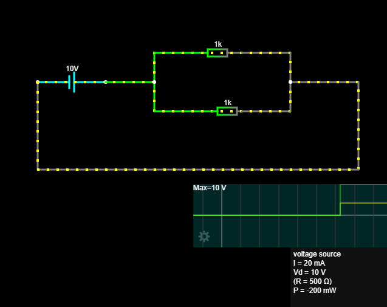

## Paralelni spoj

U paralelnom spoju sve grane imaju isti napon.

Struja se dijeli između grana, a ukupna struja jednaka je zbroju struja po granama:

Iuk = I1 + I2

Ukupni otpor računa se:

1 / Ruk = 1 / R1 + 1 / R2

## Izračun

Za dva jednaka otpornika od 1 kΩ:

Ruk = 500 Ω
U = 10 V
Iuk = 20 mA
I1 = 10 mA
I2 = 10 mA

## Zaključak

Napon je jednak na svim granama.
Struja se dijeli.
Ukupni otpor manji je od najmanjeg pojedinačnog otpora.

## Slika simulacije

