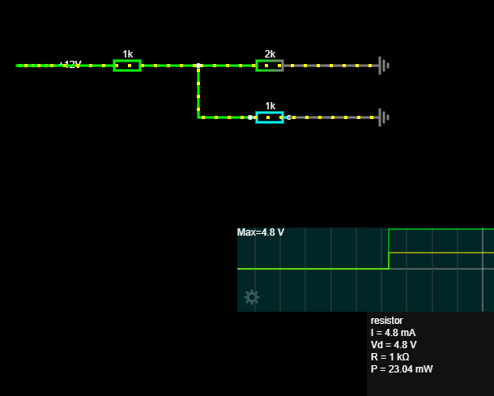
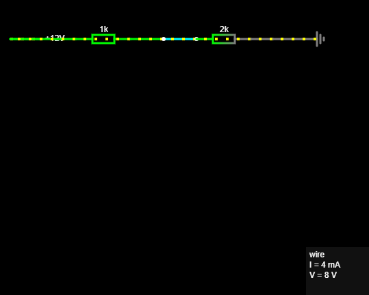
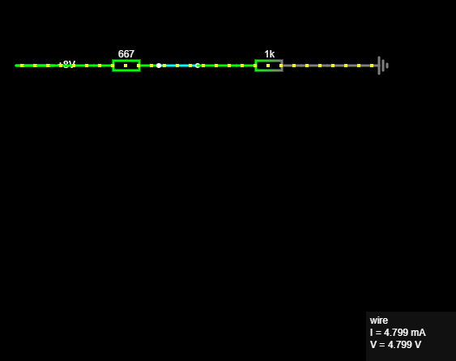

# 09 – Théveninov teorem

## Cilj projekta

Cilj projekta bio je provjeriti Théveninov teorem pomoću izračuna i Falstad simulacije.

Uspoređena su dva kruga:

1. originalni krug s opterećenjem
2. Théveninov ekvivalent

Ako originalni krug i Théveninov ekvivalent daju isti napon i istu struju na istom opterećenju, ekvivalent je ispravan.

---

## Teorija

Théveninov teorem kaže da se linearni električni krug gledan s dvije priključnice može zamijeniti jednostavnijim ekvivalentnim krugom.

Théveninov ekvivalent sastoji se od:

* jednog naponskog izvora `Vth`
* jednog serijskog otpora `Rth`
* opterećenja `RL`

Opterećenje se najprije uklanja kako bi se odredili `Vth` i `Rth`, a zatim se ponovno spaja na Théveninov ekvivalent.

---

## Originalni krug

Korištene vrijednosti:

```text
Vin = 12 V
R1 = 1 kΩ
R2 = 2 kΩ
RL = 1 kΩ
```

Originalni krug:

```text
12 V source → R1 = 1 kΩ → Vout
                         │
                         ├── R2 = 2 kΩ → GND
                         │
                         └── RL = 1 kΩ → GND
```

Otpornik `RL` predstavlja opterećenje.

U originalnom krugu izmjeren je napon na opterećenju:

```text
Vload ≈ 4.8 V
```

Struja kroz opterećenje:

```text
Iload = Vload / RL
Iload = 4.8 V / 1000 Ω
Iload = 0.0048 A
Iload = 4.8 mA
```



---

## Određivanje Théveninova napona

Za određivanje Théveninova napona `Vth` uklanja se opterećenje `RL`.

Tada ostaje djelitelj napona:

```text
12 V source → R1 = 1 kΩ → Vout
                         │
                         └── R2 = 2 kΩ → GND
```

`Vth` je napon otvorenog izlaza, odnosno napon između `Vout` i `GND` kada nema opterećenja.

Formula za djelitelj napona:

```text
Vth = Vin × R2 / (R1 + R2)
```

Izračun:

```text
Vth = 12 V × 2 kΩ / (1 kΩ + 2 kΩ)

Vth = 12 V × 2 / 3

Vth = 8 V
```

U Falstadu je dobiveno:

```text
Vth ≈ 8 V
```



---

## Određivanje Théveninova otpora

Za određivanje Théveninova otpora `Rth` opterećenje `RL` ostaje uklonjeno, a nezavisni naponski izvor se gasi.

Kod idealnog naponskog izvora gašenje znači:

```text
naponski izvor → kratki spoj
```

Nakon zamjene naponskog izvora kratkim spojem, gledano s izlaza prema `GND`, otpornici `R1` i `R2` nalaze se paralelno.

Zato je:

```text
Rth = R1 || R2
```

Formula za paralelni spoj dvaju otpornika:

```text
Rth = (R1 × R2) / (R1 + R2)
```

Izračun:

```text
Rth = (1 kΩ × 2 kΩ) / (1 kΩ + 2 kΩ)

Rth = 2 / 3 kΩ

Rth ≈ 0.667 kΩ

Rth ≈ 667 Ω
```

Dakle:

```text
Rth ≈ 667 Ω
```

---

## Théveninov ekvivalent

Théveninov ekvivalent originalnog kruga sastoji se od:

```text
Vth = 8 V
Rth = 667 Ω
RL = 1 kΩ
```

Ekvivalentni krug:

```text
8 V source → Rth = 667 Ω → Vout → RL = 1 kΩ → GND
```

Izračun napona na opterećenju:

```text
Vload = Vth × RL / (Rth + RL)
```

```text
Vload = 8 V × 1000 Ω / (667 Ω + 1000 Ω)

Vload = 8000 / 1667

Vload ≈ 4.8 V
```

Struja kroz opterećenje:

```text
Iload = Vload / RL

Iload = 4.8 V / 1000 Ω

Iload = 4.8 mA
```

U Falstadu je Théveninov ekvivalent dao isti rezultat kao originalni krug:

```text
Vload ≈ 4.8 V
Iload ≈ 4.8 mA
```



---

## Usporedba rezultata

| Veličina     | Originalni krug | Théveninov ekvivalent |
| ------------ | --------------: | --------------------: |
| Ulazni izvor |            12 V |                   8 V |
| R1           |            1 kΩ |                     — |
| R2           |            2 kΩ |                     — |
| Rth          |               — |                 667 Ω |
| RL           |            1 kΩ |                  1 kΩ |
| Vload        |         ≈ 4.8 V |               ≈ 4.8 V |
| Iload        |        ≈ 4.8 mA |              ≈ 4.8 mA |

---

## Što je potvrđeno simulacijom

U vježbi su napravljena tri koraka:

1. Izmjeren je napon na opterećenju u originalnom krugu.
2. Uklonjeno je opterećenje i određen je otvoreni napon `Vth`.
3. Izračunat je `Rth` i napravljen je Théveninov ekvivalent.

Nakon toga je isti `RL` spojen na Théveninov ekvivalent.

Originalni krug i Théveninov ekvivalent dali su isti napon na opterećenju.

---

## Zaključak

Théveninov teorem omogućuje da se složeniji dio linearnog električnog kruga zamijeni jednostavnijim modelom.

Taj model sastoji se od jednog naponskog izvora i jednog serijskog otpora.

U ovoj vježbi originalni krug imao je:

```text
Vin = 12 V
R1 = 1 kΩ
R2 = 2 kΩ
RL = 1 kΩ
```

Théveninov ekvivalent bio je:

```text
Vth = 8 V
Rth ≈ 667 Ω
RL = 1 kΩ
```

Oba kruga dala su:

```text
Vload ≈ 4.8 V
Iload ≈ 4.8 mA
```

Time je potvrđeno da Théveninov ekvivalent ispravno zamjenjuje originalni krug gledan s priključnica opterećenja.

