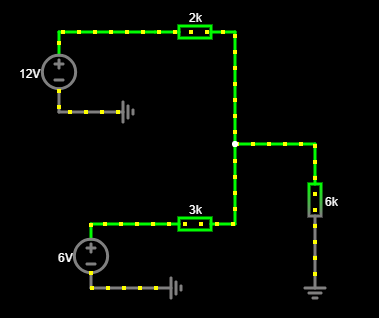
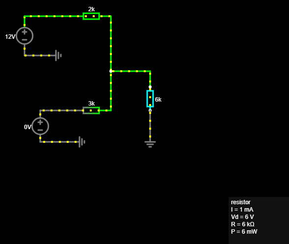
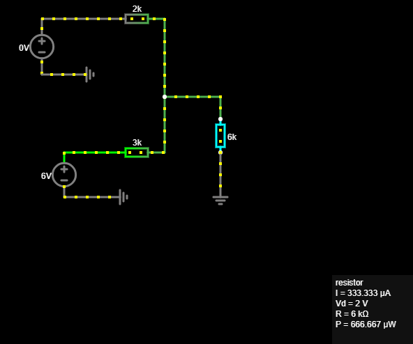

# Superposition Theorem – DC Circuit Analysis

A simple Falstad simulation demonstrating the **superposition theorem** in a linear DC resistive circuit with two independent voltage sources.

## Circuit

The circuit contains:

| Component | Value |
|---|---:|
| V1 | 12 V |
| V2 | 6 V |
| R1 | 2 kΩ |
| R2 | 3 kΩ |
| RL | 6 kΩ |

Both voltage sources share a common ground.

The two source branches meet at node **A**, while the load resistor `RL` is connected between node A and ground.

```text
V1 = 12 V ── R1 = 2 kΩ ──┐
                           ├── A ── RL = 6 kΩ ── GND
V2 = 6 V  ── R2 = 3 kΩ ──┘

Objective

The goal is to verify the superposition theorem by calculating the contribution of each independent voltage source separately and comparing their sum with the complete circuit.

Superposition Rule

For each analysis:

keep one independent voltage source active
set the other ideal voltage source to 0 V
a 0 V ideal voltage source behaves as a short circuit
keep all resistors in the circuit
Case 1 – V1 Active
V1 = 12 V
V2 = 0 V

Node voltage:

VA1 = 6 V

Load current:

IL1 = VA1 / RL
IL1 = 6 V / 6 kΩ
IL1 = 1 mA
Case 2 – V2 Active
V1 = 0 V
V2 = 6 V

Node voltage:

VA2 = 2 V

Load current:

IL2 = VA2 / RL
IL2 = 2 V / 6 kΩ
IL2 = 0.333 mA
Combined Result

Using superposition:

VA = VA1 + VA2
VA = 6 V + 2 V
VA = 8 V

and:

IL = IL1 + IL2
IL = 1 mA + 0.333 mA
IL = 1.333 mA

Verification:

IL = VA / RL
IL = 8 V / 6 kΩ
IL = 1.333 mA

The calculated and simulated results agree.

Falstad Verification

The circuit was tested in three configurations:

Both voltage sources active
V1 active and V2 set to 0 V
V2 active and V1 set to 0 V

The individual contributions add up to the result obtained with both sources active.

Results
Case	VA	IL
V1 only	6 V	1.000 mA
V2 only	2 V	0.333 mA
Both sources	8 V	1.333 mA
What I Learned
application of the superposition theorem
analysis of circuits with multiple independent sources
deactivation of ideal voltage sources
use of a common ground in Falstad
comparison of analytical calculations with circuit simulation


Tools
Falstad Circuit Simulator
Obsidian
GitHub






