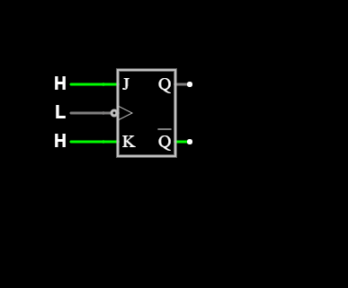
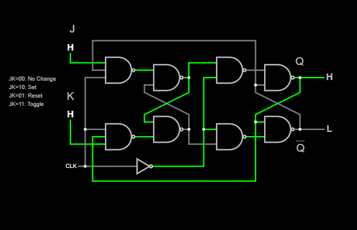
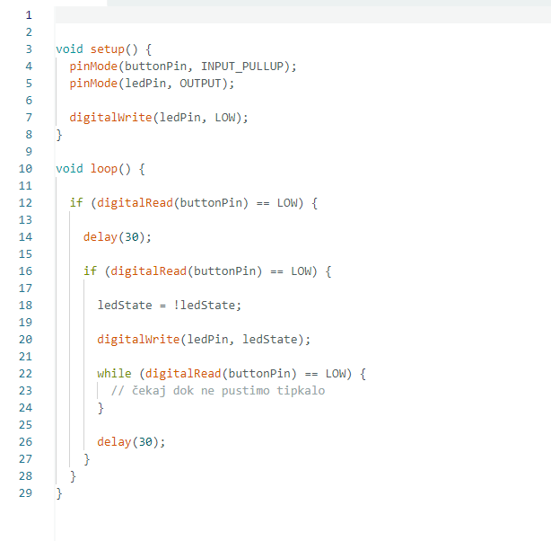

# JK Flip-Flop Toggle – Falstad Simulation

This project demonstrates the **toggle behavior of a JK flip-flop** using the Falstad Circuit Simulator.

The simulation was created to connect the idea of a software toggle used in Arduino with its equivalent implementation in digital electronics.

---

## Objective

The goal of the simulation is to observe how a JK flip-flop stores and changes a binary state.

With:

```text
J = HIGH
K = HIGH
```

the JK flip-flop operates in **toggle mode**.

Each active clock edge changes the output:

```text
LOW → HIGH
HIGH → LOW
```

Therefore:

```text
Q = 0
↓ clock
Q = 1
↓ clock
Q = 0
↓ clock
Q = 1
...
```

---

## JK Flip-Flop Inputs and Outputs

The component contains three inputs:

* `J`
* `K`
* `CLK` – clock input

and two outputs:

* `Q`
* `Q̅` – inverted output

The outputs are always complementary:

```text
Q = HIGH  → Q̅ = LOW

Q = LOW   → Q̅ = HIGH
```

---

## JK Flip-Flop Truth Table

| J | K | Operation |
| - | - | --------- |
| 0 | 0 | No change |
| 0 | 1 | Reset     |
| 1 | 0 | Set       |
| 1 | 1 | Toggle    |

For this experiment:

```text
J = 1
K = 1
```

Therefore the circuit operates in **toggle mode**.

---

## Falstad Circuit

The JK flip-flop was connected to three manual Logic Inputs.

```text
       J = H
         │
         ▼
      ┌─────────┐
      │ J     Q │──── Q
CLK ─▶│>        │
      │ K    Q̅ │──── Q̅
      └─────────┘
         ▲
         │
       K = H
```

The configuration used was:

```text
J   = HIGH
K   = HIGH
CLK = manually controlled
```

The `J` and `K` inputs remain HIGH throughout the experiment.

Only the clock input is changed manually.

---

## Clock Operation

The JK flip-flop used in this simulation is triggered by the relevant clock edge.

In this Falstad configuration, the output changes on the **falling edge**:

```text
CLK: HIGH → LOW
```

Example:

```text
Initial state:

Q = LOW
Q̅ = HIGH

CLK: LOW → HIGH
Q remains LOW

CLK: HIGH → LOW
Q becomes HIGH
Q̅ becomes LOW

CLK: LOW → HIGH
Q remains HIGH

CLK: HIGH → LOW
Q becomes LOW
Q̅ becomes HIGH
```

Therefore, the output changes only when the required clock transition occurs.

---

## Toggle Sequence

With `J = K = HIGH`:

```text
        Active clock edge

Q = 0  ───────────────▶  Q = 1

        Active clock edge

Q = 1  ───────────────▶  Q = 0
```

The flip-flop therefore stores one bit of information and changes that stored state every time a valid clock event occurs.

---

## Connection to the Arduino Toggle Project

This simulation demonstrates the hardware equivalent of the Arduino toggle project.

In Arduino, the state of the LED was stored in a Boolean variable:

```cpp
bool ledState = false;
```

The state was changed using:

```cpp
ledState = !ledState;
```

This produces:

```text
false → true
true  → false
```

which corresponds to:

```text
LOW → HIGH
HIGH → LOW
```

The new state was then sent to the LED output:

```cpp
digitalWrite(ledPin, ledState);
```

---

## Software vs Hardware Toggle

### Arduino

```text
Button press
     ↓
program detects LOW on D2
     ↓
ledState = !ledState
     ↓
D8 changes LOW ↔ HIGH
     ↓
LED changes OFF ↔ ON
```

### JK Flip-Flop

```text
Clock event
     ↓
J = 1 and K = 1
     ↓
Q changes LOW ↔ HIGH
     ↓
stored digital state changes
```

The important conceptual connection is:

| Arduino                | Digital Electronics |
| ---------------------- | ------------------- |
| `ledState`             | `Q`                 |
| `false`                | LOW                 |
| `true`                 | HIGH                |
| `ledState = !ledState` | JK toggle           |
| Button event           | Clock event         |
| Software memory        | Hardware memory     |

---

## Why a Flip-Flop Is Important

A flip-flop is a basic **memory element** in digital electronics.

Unlike a simple combinational logic gate, its output depends not only on the current inputs but also on its **previous state**.

A single flip-flop can store:

```text
1 bit
```

either:

```text
0
```

or:

```text
1
```

Flip-flops are fundamental building blocks of:

* registers
* counters
* state machines
* digital memory
* sequential logic circuits
* processors and control systems

---

## Simulation Procedure

1. Add a **JK Flip-Flop** in Falstad.
2. Add three **Logic Inputs**.
3. Connect the upper input to `J`.
4. Connect the middle input to `CLK`.
5. Connect the lower input to `K`.
6. Set:

```text
J = HIGH
K = HIGH
```

7. Manually change the clock:

```text
LOW → HIGH → LOW
```

8. Observe `Q` and `Q̅`.
9. Repeat several clock cycles.
10. Verify that Q alternates:

```text
LOW → HIGH → LOW → HIGH
```

---

## Results

The simulation confirmed that when:

```text
J = HIGH
K = HIGH
```

the JK flip-flop toggles its stored state at every active clock edge.

Observed sequence:

```text
Q:

LOW
 ↓
HIGH
 ↓
LOW
 ↓
HIGH
```

At all times:

```text
Q̅ = NOT Q
```

---
## Screenshots
JK Flip-Flop with Manual Logic Inputs

The JK flip-flop was connected to three manually controlled Logic Inputs for J, CLK, and K.

With J = HIGH and K = HIGH, changing the clock manually demonstrates the toggle behavior of the output Q.



Push Button and Current Flow

The button simulation helps visualize the change in the electrical path when the button changes state.

This corresponds to the Arduino button input, where pressing the button connects the input pin to GND when INPUT_PULLUP is used.



Arduino Toggle Code

The Arduino implementation stores the LED state in the Boolean variable ledState and reverses it after each valid button press:

ledState = !ledState;

The new state is then applied to digital pin D8:

digitalWrite(ledPin, ledState);




## Project Structure
jk-flip-flop-toggle/
│
├── README.md
│
└── screenshots/
    ├── jk-flip-flop-logic-inputs.png
    ├── button-current-flow.png
    └── arduino-toggle-code.png

## Conclusion

The JK flip-flop demonstrates how digital electronics can store and toggle a binary state without software.

With both J and K set HIGH, every valid clock event changes Q to its opposite state:

```text
Q = NOT Q
```

This is directly comparable to the Arduino instruction:

```cpp
ledState = !ledState;
```

The Arduino implementation stores the state in software, while the JK flip-flop stores the state directly in hardware.

