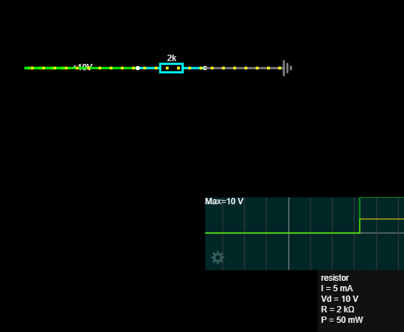
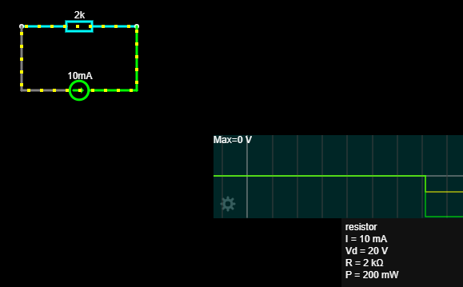

# 07 – DC mjerenja i analiza

## Cilj projekta

Cilj projekta bio je primijeniti Ohmov i Kirchhoffove zakone na djelitelj napona, upoznati idealne naponske i strujne izvore te naučiti osnovno korištenje digitalnog multimetra.

## Djelitelj napona

Korištene vrijednosti:

```text
Vin = 12 V
R1 = 1 kΩ
R2 = 2 kΩ
```

Ukupni otpor:

```text
Ruk = R1 + R2
Ruk = 3 kΩ
```

Struja:

```text
I = Vin / Ruk
I = 12 V / 3 kΩ
I = 4 mA
```

Padovi napona:

```text
UR1 = I × R1 = 4 V
UR2 = I × R2 = 8 V
```

Izlazni napon preko R2:

```text
Vout = Vin × R2 / (R1 + R2)
Vout = 8 V
```


## Idealni izvori

## Idealni naponski izvor

Idealni naponski izvor održava zadani napon, dok se struja mijenja ovisno o priključenom otporu.

Prvi primjer
U = 10 V
R = 1 kΩ

Prema Ohmovu zakonu:

I = U / R
I = 10 V / 1000 Ω
I = 10 mA
Drugi primjer

Otpornik je promijenjen na:

R = 2 kΩ

Nova struja:

I = 10 V / 2000 Ω
I = 5 mA

Napon je ostao jednak:

U = 10 V
Simulacija

Zaključak

Kod idealnog naponskog izvora napon ostaje konstantan, dok se struja mijenja ovisno o otporu opterećenja.

veći otpor → manja struja
manji otpor → veća struja

## Idealni strujni izvor

Idealni strujni izvor održava zadanu struju, dok se napon mijenja ovisno o priključenom otporu.

Prvi primjer
I = 5 mA
R = 1 kΩ

Prema Ohmovu zakonu:

U = I × R
U = 0,005 A × 1000 Ω
U = 5 V
Drugi primjer

Otpornik je promijenjen na:

R = 2 kΩ

Novi napon:

U = 0,005 A × 2000 Ω
U = 10 V

Struja je ostala jednaka:

I = 5 mA
Simulacija

Napomena o Groundu

Simulacija je radila i bez posebnog Grounda jer je električni krug bio zatvoren.

Ground služi kao referentna točka od 0 V. Bez Grounda krug može biti električki zatvoren, ali nema određen apsolutni napon prema referentnoj točki.

Razlike napona između komponenti i struja kroz krug i dalje se mogu izračunati.





## Zaključak

Kod idealnog strujnog izvora struja ostaje konstantna, dok se napon mijenja ovisno o otporu opterećenja.

veći otpor → veći napon
manji otpor → manji napon

## Multimetar

U praktičnoj vježbi korišten je multimetar za mjerenje:

* DC napona
* otpora
* kontinuiteta
* izlaznog napona djelitelja

Najvažnija pravila:

```text
napon se mjeri paralelno
struja se mjeri serijski
otpor i kontinuitet mjere se na isključenom krugu
```


## Zaključak

Izračunate vrijednosti uspoređene su s Falstad simulacijom i mjerenjima multimetrom.

Djelitelj napona proizvodi izlazni napon određen omjerom serijski spojenih otpornika.

Multimetar omogućuje praktičnu provjeru teorijski izračunatih vrijednosti i ponašanja stvarnog električnog kruga.

