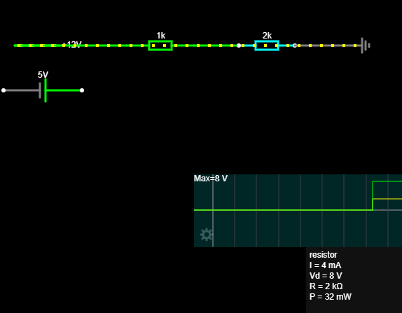
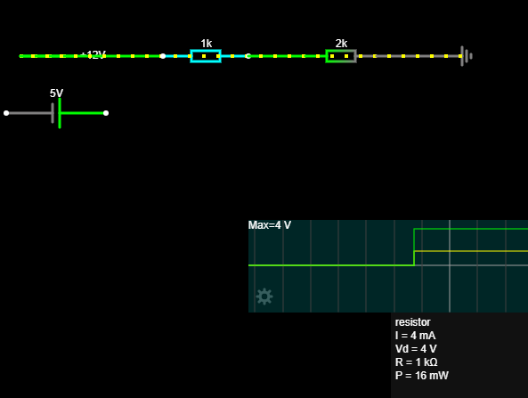

# 07 – DC mjerenja i analiza

## Cilj projekta

Cilj projekta bio je primijeniti Ohmov i Kirchhoffove zakone na djelitelj napona, upoznati idealne naponske i strujne izvore te naučiti osnovno korištenje digitalnog multimetra.

## Djelitelj napona

Korištene vrijednosti:

```text
Vin = 12 V
R1 = 1 kΩ
R2 = 2 kΩ
```

Ukupni otpor:

```text
Ruk = R1 + R2
Ruk = 3 kΩ
```

Struja:

```text
I = Vin / Ruk
I = 12 V / 3 kΩ
I = 4 mA
```

Padovi napona:

```text
UR1 = I × R1 = 4 V
UR2 = I × R2 = 8 V
```

Izlazni napon preko R2:

```text
Vout = Vin × R2 / (R1 + R2)
Vout = 8 V
```





## Idealni izvori

Idealni naponski izvor održava zadani napon, dok idealni strujni izvor održava zadanu struju.

### Naponski izvor

```text
U = 10 V
R = 1 kΩ
I = 10 mA
```


### Strujni izvor

```text
I = 5 mA
R = 1 kΩ
U = 5 V
```


## Multimetar

U praktičnoj vježbi korišten je multimetar za mjerenje:

* DC napona
* otpora
* kontinuiteta
* izlaznog napona djelitelja

Najvažnija pravila:

```text
napon se mjeri paralelno
struja se mjeri serijski
otpor i kontinuitet mjere se na isključenom krugu
```


## Zaključak

Izračunate vrijednosti uspoređene su s Falstad simulacijom i mjerenjima multimetrom.

Djelitelj napona proizvodi izlazni napon određen omjerom serijski spojenih otpornika.

Multimetar omogućuje praktičnu provjeru teorijski izračunatih vrijednosti i ponašanja stvarnog električnog kruga.

