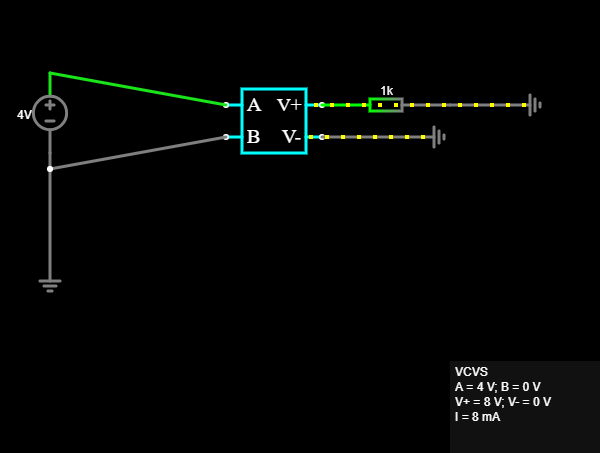

# Voltage-Controlled Voltage Source (VCVS)

A simple CircuitJS/Falstad exercise demonstrating the operation of a
voltage-controlled voltage source.

## Objective

Model a dependent voltage source defined by:

Vout = 2Vx

with a 1 kΩ load resistor.

## Circuit

Control voltage:

Vx = 4 V

Dependent source:

Vout = 2Vx

Load:

RL = 1 kΩ

Therefore:

Vout = 2 × 4 V = 8 V

and:

IL = Vout / RL

IL = 8 V / 1 kΩ = 8 mA

## Falstad Configuration

A Voltage-Controlled Voltage Source (VCVS) was used.

Control inputs:

- A = +4 V
- B = GND

Output:

- V+ = load
- V- = GND

Output Function:

`2*(a-b)`

This implements:

Vout = 2(VA - VB)

## Expected Results

| Vx | Vout | Load Current |
|---:|---:|---:|
| 3 V | 6 V | 6 mA |
| 4 V | 8 V | 8 mA |
| 5 V | 10 V | 10 mA |

## Key Concept

Unlike an independent source, a dependent source does not have a fixed
output value.

Its output is determined by another voltage or current in the circuit.

For this circuit:

Vout = 2Vx

so any change in the controlling voltage produces a proportional change
in the output voltage.

## Connection to Superposition

Dependent sources remain active during superposition analysis.

Only independent sources are deactivated individually.

## Tools

- CircuitJS / Falstad Circuit Simulator
- Manual circuit analysis

## Photo

