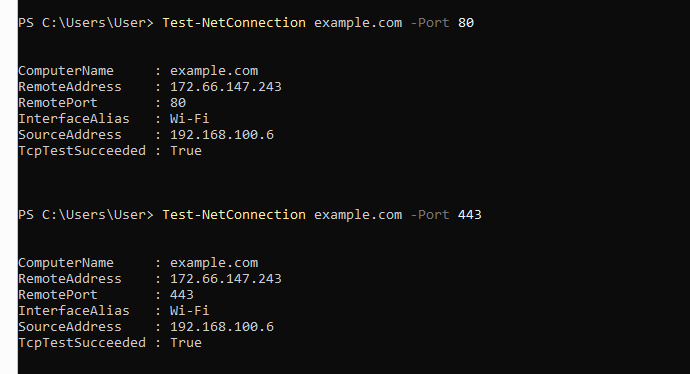

# Cyber 04 – HTTP, HTTPS i osnovna provjera web-komunikacije

## Cilj vježbe

Cilj vježbe bio je povezati prethodno naučene mrežne pojmove:

* IP adresu
* DNS
* TCP
* portove
* HTTP
* HTTPS

U vježbi su korištene PowerShell i Windows mrežne naredbe za:

* pronalaženje IP adrese domene
* provjeru dostupnosti portova 80 i 443
* pregled HTTP i HTTPS zaglavlja odgovora web-servera

---

## Osnovni pojmovi

```text
IP adresa = adresa uređaja ili servera
DNS = prevodi naziv domene u IP adresu
TCP = uspostavlja pouzdanu vezu
Port = određuje uslugu ili aplikaciju
HTTP = web-komunikacija bez TLS zaštite
HTTPS = web-komunikacija zaštićena TLS-om
```

Najčešći portovi:

```text
80 = HTTP
443 = HTTPS
53 = DNS
22 = SSH
```

---

## 1. DNS provjera

Korištena naredba:

```powershell
nslookup example.com
```

Nared-komunikacija bez TLS zaštite
HTTPS = web-komunikacija zaštićena TLS-om

````

Najčešći portovi:

```text
80 = HTTP
443 =ba `nslookup` šalje upit DNS sustavu i prikazuje IP adresu povezanu s domenom.

Time se potvrđuje proces:

```text
domena → DNS → IP adresa
````

---

## 2. Provjera HTTP porta 80

Korištena naredba:

```powershell
Test-NetConnection example.com -Port 80
```

Port 80 najčešće koristi HTTP.

Ako rezultat sadrži:

```text
TcpTestSucceeded : True
```

to znači da je TCP veza prema portu 80 uspješno uspostavljena.

---

## 3. Provjera HTTPS porta 443

Korištena naredba:

```powershell
Test-NetConnection example.com -Port 443
```

Port 443 najčešće koristi HTTPS.

HTTPS koristi TLS kako bi zaštitio komunikaciju između klijenta i web-servera.

Ako rezultat sadrži:

```text
TcpTestSucceeded : True
```

TCP veza prema HTTPS usluzi je uspješna.

## Slika provjere



---

## 4. Pregled HTTP zaglavlja

Korištena naredba:

```powershell
curl.exe -I http://example.com
```

Opcija `-I` traži samo zaglavlja HTTP odgovora, bez preuzimanja cijelog sadržaja stranice.

Mogući rezultat:

```text
HTTP/1.1 200 OK
Content-Type: text/html
Content-Length: ...
Date: ...
```

Značenje važnijih stavki:

* `200 OK` – zahtjev je uspješno obrađen
* `Content-Type` – vrsta sadržaja
* `Content-Length` – veličina sadržaja
* `Date` – vrijeme odgovora servera
* `Server` – podatak o serveru, ako ga server prikazuje

Server može vratiti i:

```text
301 Moved Permanently
```

To znači da je resurs trajno preusmjeren, često s HTTP-a na HTTPS.

---

## 5. Pregled HTTPS zaglavlja

Korištena naredba:

```powershell
curl.exe -I https://example.com
```

Ova naredba prikazuje zaglavlja odgovora dobivenog preko HTTPS veze.

Razlika u odnosu na HTTP jest u tome što HTTPS koristi TLS enkripciju za zaštitu komunikacije.

---

## Napomena za PowerShell

U PowerShellu naredba:

```powershell
curl
```

može biti alias za:

```powershell
Invoke-WebRequest
```

Zbog toga opcija `-I` može biti protumačena pogrešno i PowerShell može tražiti parametar `Uri`.

Za pokretanje stvarnog programa `curl` koristi se:

```powershell
curl.exe
```

PowerShellova alternativa je:

```powershell
Invoke-WebRequest -Uri "https://example.com" -Method Head
```

---

## Kako komunikacija izgleda kao cjelina

```text
1. DNS prevodi domenu u IP adresu.
2. TCP uspostavlja vezu sa serverom.
3. Port 80 ili 443 određuje web-uslugu.
4. HTTP ili HTTPS prenosi zahtjev i odgovor.
5. HTTPS dodatno koristi TLS zaštitu.
```

---

## Korištene naredbe

```powershell
nslookup example.com

Test-NetConnection example.com -Port 80

Test-NetConnection example.com -Port 443

curl.exe -I http://example.com

curl.exe -I https://example.com
```

---

## Zaključak

Ovom vježbom povezani su DNS, IP adrese, TCP, portovi i web-protokoli.

DNS pronalazi IP adresu servera. TCP uspostavlja vezu. Port određuje kojoj se usluzi pristupa, dok HTTP ili HTTPS određuje način web-komunikacije.

```text
HTTP → port 80
HTTPS → port 443 + TLS zaštita
```

Naredba `Test-NetConnection` korištena je za provjeru TCP dostupnosti portova, dok je `curl.exe -I` korišten za pregled zaglavlja odgovora web-servera.

