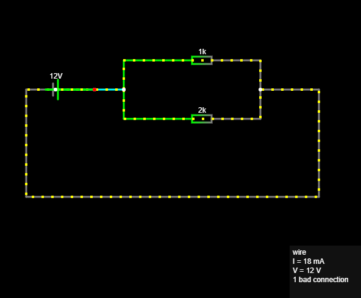
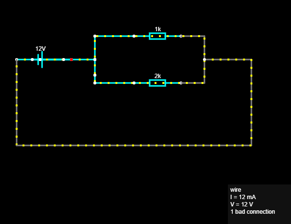
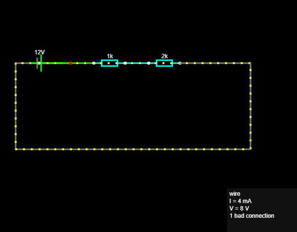

# 06 – Kirchhoffovi zakoni

## Cilj projekta

Cilj projekta bio je razumjeti i provjeriti dva Kirchhoffova zakona:

* Kirchhoffov zakon struje – KCL
* Kirchhoffov zakon napona – KVL

Električni krugovi izrađeni su u Falstad Circuit Simulatoru, a rezultati su provjereni izračunom.

---

# 1. Kirchhoffov zakon struje – KCL

Kirchhoffov zakon struje primjenjuje se na **čvor** električnog kruga.

Čvor je skup međusobno povezanih točaka istog električnog potencijala. Na čvoru se struja može podijeliti na više grana ili se više struja može spojiti u jednu.

Ukupna struja koja ulazi u čvor jednaka je ukupnoj struji koja iz njega izlazi:

```text
ΣIulaz = ΣIizlaz
```

KCL proizlazi iz zakona očuvanja električnog naboja. Električni naboj ne može nestati niti nastati u čvoru.

## Vrijednosti simulacije

```text
U = 12 V
R1 = 1 kΩ
R2 = 2 kΩ
```

Otpornici su spojeni paralelno, pa je napon na obje grane jednak naponu izvora:

```text
U1 = U2 = 12 V
```

## Izračun struje kroz prvu granu

Prema Ohmovu zakonu:

```text
I1 = U / R1
I1 = 12 V / 1000 Ω
I1 = 0,012 A
I1 = 12 mA
```

## Izračun struje kroz drugu granu

```text
I2 = U / R2
I2 = 12 V / 2000 Ω
I2 = 0,006 A
I2 = 6 mA
```

## Ukupna struja

```text
Iuk = I1 + I2
Iuk = 12 mA + 6 mA
Iuk = 18 mA
```

## Provjera KCL-a

U čvor ulazi ukupna struja od 18 mA, a zatim se dijeli na dvije grane:

```text
18 mA = 12 mA + 6 mA
```

Kirchhoffov zakon struje je potvrđen.

## Simulacija KCL-a




 
---

# 2. Kirchhoffov zakon napona – KVL

Kirchhoffov zakon napona primjenjuje se na **zatvorenu petlju** električnog kruga.

Algebarski zbroj svih porasta i padova napona u zatvorenoj petlji jednak je nuli:

```text
ΣU = 0
```

Izvor predstavlja porast napona, dok otpornici predstavljaju padove napona.

KVL proizlazi iz zakona očuvanja energije. Energija koju izvor preda krugu pretvara se ili troši na komponentama kruga.

## Vrijednosti simulacije

```text
Uizvor = 12 V
R1 = 1 kΩ
R2 = 2 kΩ
```

Otpornici su spojeni serijski.

## Ukupni otpor

Kod serijskog spoja otpori se zbrajaju:

```text
Ruk = R1 + R2
Ruk = 1 kΩ + 2 kΩ
Ruk = 3 kΩ
```

## Struja u krugu

Prema Ohmovu zakonu:

```text
I = U / Ruk
I = 12 V / 3000 Ω
I = 0,004 A
I = 4 mA
```

Kroz oba serijski spojena otpornika teče ista struja.

## Pad napona na prvom otporniku

```text
UR1 = I × R1
UR1 = 0,004 A × 1000 Ω
UR1 = 4 V
```

## Pad napona na drugom otporniku

```text
UR2 = I × R2
UR2 = 0,004 A × 2000 Ω
UR2 = 8 V
```

## Provjera KVL-a

```text
Uizvor - UR1 - UR2 = 0
```

Uvrštavanjem vrijednosti:

```text
12 V - 4 V - 8 V = 0 V
```

Ukupni porast napona izvora jednak je ukupnim padovima napona na otpornicima. Kirchhoffov zakon napona je potvrđen.

## Simulacija KVL-a



---

# Sažetak

```text
KCL → čvor → struje
ΣIulaz = ΣIizlaz

KVL → zatvorena petlja → naponi
ΣU = 0
```

Kirchhoffov zakon struje pokazuje da se električni naboj ne gubi u čvoru.

Kirchhoffov zakon napona pokazuje da je u zatvorenoj petlji ukupni porast napona jednak ukupnom padu napona.

Kirchhoffovi zakoni zajedno s Ohmovim zakonom omogućuju analizu složenijih električnih krugova.

